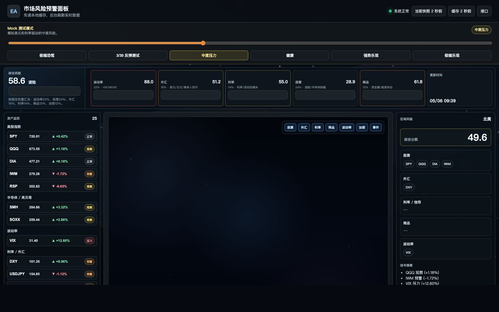
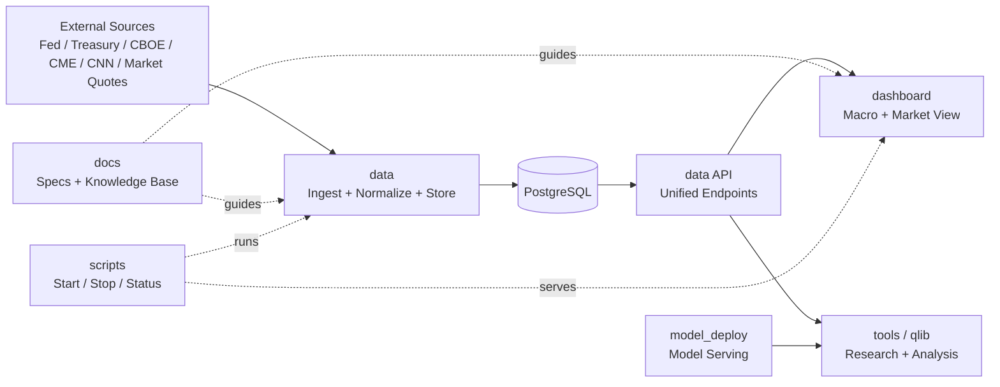

# EvergreenAlpha

<p align="center">
  市场数据基础设施 · 宏观可视化看板 · 量化研究与部署
</p>

<p align="center">
  
  
  
  
</p>

<p align="center">
  
</p>

<p align="center">
  统一展示实时行情与宏观指标，支持数据来源追溯、落库存档与分析。
</p>

## 仓库地图

| Repo | 角色定位 | 核心能力 |
| --- | --- | --- |
| [`.github`](https://github.com/EvergreenAlpha/.github) | 组织入口与协作规范 | 组织 README、协作说明、统一导航 |
| [`data`](https://github.com/EvergreenAlpha/data) | 数据后端与落库服务 | FastAPI、Scheduler、PostgreSQL、统一 API |
| [`dashboard`](https://github.com/EvergreenAlpha/dashboard) | 前端可视化 | 实时行情、宏观卡片、色彩语义、刷新控制 |
| [`docs`](https://github.com/EvergreenAlpha/docs) | 产品与系统文档 | 风险看板 PRD、UI 知识文档、指标口径 |
| [`scripts`](https://github.com/EvergreenAlpha/scripts) | 本地运行脚本 | 一键启动、停止、状态检查 |
| [`tools`](https://github.com/EvergreenAlpha/tools) | 分析与工具链 | 本地分析工具、结构化输出、自动化脚本 |
| [`model_deploy`](https://github.com/EvergreenAlpha/model_deploy) | 模型推理部署 | `llama.cpp`、HTTPS 反向代理、服务化入口 |
| [`qlib`](https://github.com/EvergreenAlpha/qlib) | 研究与回测生态 | 因子研究、策略实验、回测框架集成 |

## 系统架构



## 当前数据覆盖

- 利率与曲线：SOFR、EFFR、Treasury 10Y、2s10s
- 情绪与政策：CNN FGI、CME FedWatch
- 市场行情：SPY / QQQ / DIA / XAUUSD / VIX / DXY / USDJPY
- 期权统计：SPY / QQQ / DIA（OptionCharts 多到期结构，独立刷新）

## 快速开始

```bash
# 1) 拉起数据服务和看板
./scripts/start_all.sh

# 2) 查看状态
./scripts/status_all.sh

# 3) 停止服务
./scripts/stop_all.sh
```

## 设计原则

- 单一职责：数据、展示、工具、部署解耦
- 数据可追溯：指标尽量保留来源链接与时间戳
- 先落库再分析：统一口径，减少前端与研究侧重复计算
